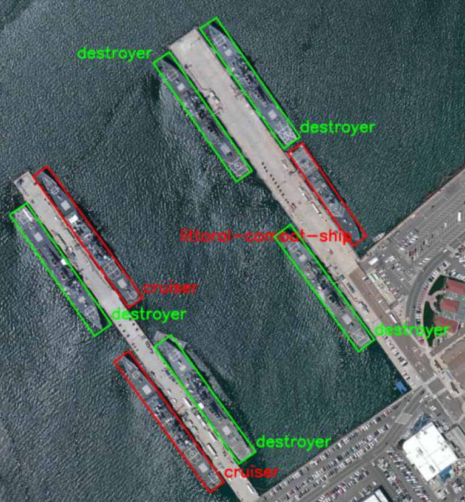
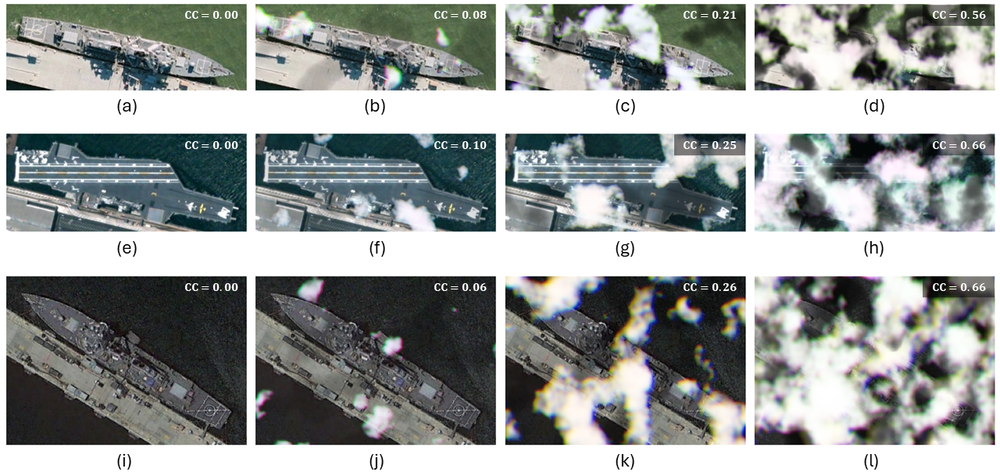
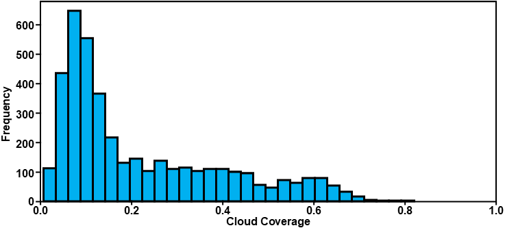
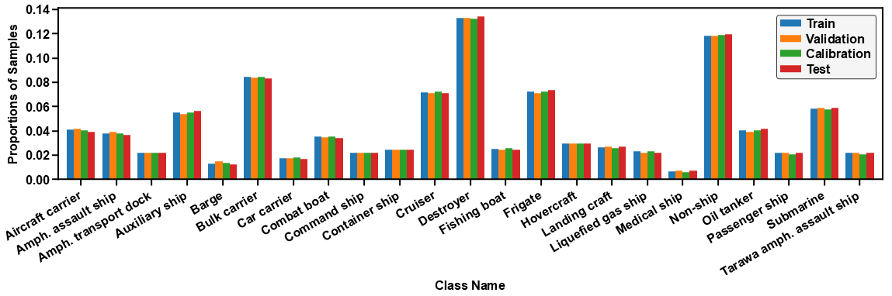
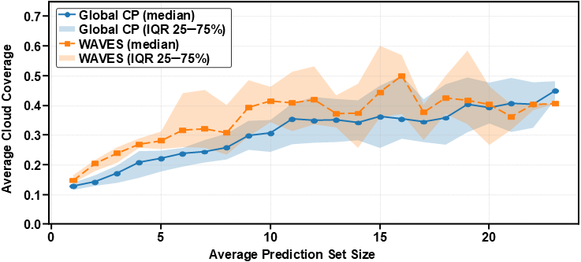

# WAVES: Weather-Aware Visual Estimation with Sets

[](LICENSE)


[](notebook.ipynb)

This repository contains the official implementation for the paper:

**"Adaptive Uncertainty Quantification for Maritime Classification under Cloud Cover in Satellite Imagery"**

*AI in Security and Defense (AI4SD) Workshop @ ECAI 2025*

## Overview

Reliable maritime vessel classification from satellite imagery is essential for tasks such as naval intelligence, search-and-rescue operations, and maritime security. However, the accuracy of traditional classifiers deteriorates significantly under meteorological conditions like clouds, haze, and fog.

This repository introduces **WAVES (Weather-Aware Visual Estimation with Sets)**, a conformal prediction-based framework that adapts uncertainty to **image quality** (cloud coverage). In practice, WAVES calibrates classifier probabilities by quality (quality-aware **temperature scaling** on a validation split) and then applies a **single global conformal threshold** on a calibration split. The result are adaptive prediction sets that remain narrow for clear images and widen under cloud cover, while retaining split-conformal marginal coverage.

## Repository Structure

```
uncertainty-aware-ship-classification/
├── data/                   # Dataset splits and metadata
│   ├── preprocessed_dataset.*      # Full augmented dataset (7z compressed)
│   ├── train_dataset.*             # Training split
│   ├── val_dataset.*               # Validation split
|   ├── cal_dataset.*               # Calibration split
│   ├── test_dataset.*              # Independent test split
│   └── preprocessed_metadata.csv   # Image metadata and cloud coverage scores
│
├── diagrams_paper/         # Paper figures and diagrams
│   ├── fig1.png            # Military vessel examples (FGSRCS dataset)
│   ├── fig2.png            # Synthetic cloud augmentation examples
│   ├── fig3.png            # Synthetic cloud coverage distribution
│   ├── fig4.png            # Class distributions for splits
│   └── fig5.png            # WAVES vs. Global CP (prediction set sizes vs. cloud coverage)
│
├── models/                 # Trained models
│   ├── best_resnet50_epoch*.7z.*      # ResNet-50 fine-tuned model
│   ├── best_convnext_tiny_epoch*.7z.* # ConvNeXt-Tiny fine-tuned model
│   ├── best_densenet121_epoch*.7z.*   # DenseNet-121 fine-tuned model
│   ├── best_efficientnet_b0_epoch*.7z.*   # EfficientNet-b0 fine-tuned model
│   ├── best_mobilenet_v3_large_epoch*.7z.*   # MobileNet-V3-Large fine-tuned model
│   └── quality_regressor.7z.*         # Cloud coverage regression model (ResNet-18)
│
├── notebook.ipynb          # Jupyter notebook for experiments
├── requirements.txt        # Python dependencies
├── results/                # Detailed results and visualizations
│   ├── all_methods_scores_combined_*                    # Comprehensive comparison of WAVES and Global CP results
│   ├── waves_*                    # WAVES results
│   ├── global_conformal_*          # Global CP method results
│   ├── comparison_*                # WAVES vs. Global CP comparisons
│   ├── confusion_matrix_*          # Confusion matrices
│   ├── regression_*                # Cloud coverage regression evaluations
│   ├── relative_class_dist.svg     # Class distribution overview
│   └── *.svg, *.csv                # Other supporting results & visualizations
│
├── LICENSE                 # MIT License
└── .gitignore              # Git configuration
```

## Key Results

### Baseline Classifier Performance (with vs. without clouds)

| Model                | Accuracy (Clear) | Accuracy (Cloud-Augmented) |
|----------------------|------------------|----------------------------|
| ResNet-50            | 75.06%           | 62.84%                     |
| DenseNet-121         | XX.XX%           | 59.90%                     |
| ConvNeXt-Tiny        | 81.66%           | 64.55%                     |
| EfficientNet-b0      | XX.XX%           | 67.73%                     |
| MobileNet-V3-Large   | XX.XX%           | 62.35%                     |

### WAVES vs. Global CP (Cloud-Augmented Data, α = 0.02, NBINS = 3)

| Model               | α    | Global CP Coverage | WAVES Coverage | Global CP Average Set Size | WAVES Average Set Size | WAVES Bins |
|---------------------|------|--------------------|----------------|----------------------------|------------------------|------------|
| ResNet-50           | 0.02 | 97.8%              | **98.3%**      | 8.94                       | **7.70**               | 3 |
| ConvNeXt-Tiny       | 0.02 | **97.1%**          | **97.1%**      | 7.08                       | **6.67**               | 3 |
| DenseNet-121        | 0.02 | **97.6%**          | 97.3%          | **10.50**                  | **10.50**              | 3 |
| EfficientNet-b0     | 0.02 | **98.3%**          | 97.6%          | 7.40                       | **7.03**               | 3 |
| MobileNet-V3-Large  | 0.02 | **97.8%**          | **97.8%**      | 8.76                       | **8.06**               | 3 |

<sup>*Representative results at strict coverage; best values bold. WAVES uses quality-aware temperature scaling (VAL) + one global conformal threshold (CAL).* </sup>

## Paper Figures (Diagrams)
| Figure | Description |
|--------|-------------|
|  | **Military Vessel Examples:** Satellite image from the FGSRCS dataset showing military vessels with high interclass similarity (destroyer, cruiser, littoral-combat-ship). |
|  | **Synthetic Cloud Augmentation:** Visual examples of synthetic cloud augmentation at different severity levels. Cloud coverage (CC) scores within each subfigure indicate feature obstruction. |
|  | **Cloud Coverage Distribution:** Distribution of synthetic cloud coverage scores in the modified FGSC-23 dataset. Most images have mild to moderate coverage; fewer have severe coverage. |
|  | **Class Distributions:** Relative class distributions for training, validation, and test splits of FGSC-23 after stratified sampling. |
|  | **WAVES vs. Global CP:** Comparison of Global Conformal Prediction and WAVES over all alpha values and models. |

## Installation and Usage

```bash
pip install -r requirements.txt
```

## Dataset Preparation

```bash
# Extract datasets from compressed .7z files into data/
7z x "data/*.7z.*" -odata/
```

## Running Experiments

Use the provided Jupyter notebook (`notebook.ipynb`) to:

- Fine-tune classification models (ResNet-50, DenseNet-121, ConvNeXt-Tiny, EfficientNet-b0, MobileNet-V3-Large).
- Train the cloud coverage regression model (ResNet-18).
- Evaluate global conformal prediction and WAVES methods.
- Generate visualizations and summarize results.

## Implemented Methods

- **Baseline Classifiers:** ResNet-50, DenseNet-121, ConvNeXt-Tiny, EfficientNet-b0, MobileNet-V3-Large.
- **Cloud Coverage Regressor:** ResNet-18 predicting cloud coverage scores.
- **Global Conformal Prediction:** Single global CP threshold for uncertainty quantification.
- **WAVES:** Quality-aware temperature scaling + one global conformal threshold.

## Repository Contents

- **Data:** Training, validation, test splits, and metadata with cloud coverage.
- **Models:** Fine-tuned classification and regression models.
- **Results:** CSV and SVG files for detailed experiment results and visualizations.

## License

Distributed under the [MIT License](LICENSE).

## Acknowledgements

This research is part of the RIVA project, funded by dtec.bw – Digitalization and Technology Research Center of the Bundeswehr, supported by the European Union – NextGenerationEU.

<p align="center">
    
</p>

## Contact

**Dr.-Ing. Gianluca Manca** (Corresponding Author)  
Chair of Automation, Ruhr University Bochum  
Email: gianluca.manca@ruhr-uni-bochum.de

*(Paper presented at AI4DS Workshop at ECAI 2025; citation details will be provided upon publication.)*